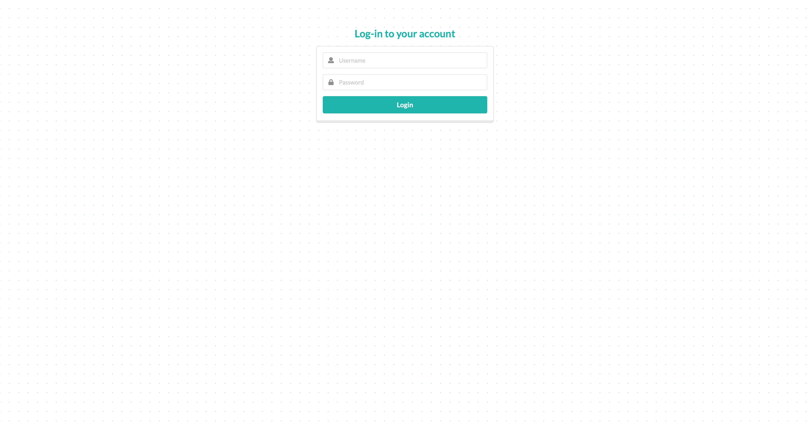

# Blog

サンプルページ：
http://47.245.42.134:8080

フロントエンド：Semantic UI
バックエンド：Spring Boot + JPA + thymeleaf
データベース：MySQL
Markdown Editor： [editor.md](https://pandao.github.io/editor.md/en.html)
レイアウト（中国語）：[typo.css](https://github.com/sofish/typo.css)
目次生成：[Tocbot](https://tscanlin.github.io/tocbot/)
QRcode生成：[qrcode.js](https://davidshimjs.github.io/qrcodejs/)

ホームページ

記事ページ

Markdownで書かれた記事から目次自動生成

ページのリンクをQRコードで表示

カテログページ

タグページ

アーカイブページ

About meページ

ログインページ
username: zzy
password: admin

ログイン成功ページ

記事管理ページ

記事編集ページ

記事新規ページ

カテゴリ管理ページ（タグも同様）

カテゴリ新規ページ（タグも同様）
